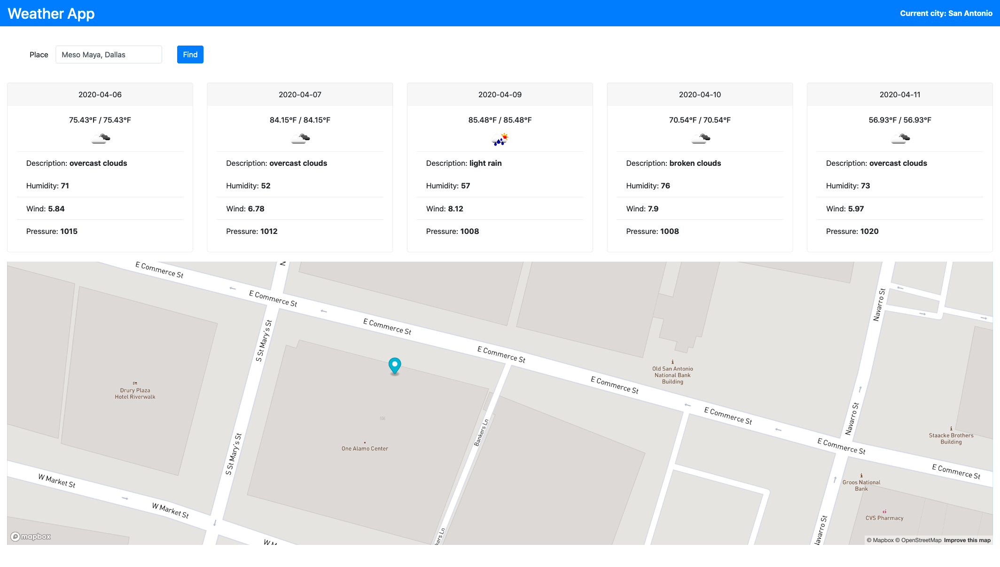

# Weather Map App

I refactored this project after working on it during a team sprint.  Much of the work I wanted to accomplish after the project's completion is accomplished.  Although you can find the original tasks below (along with a couple examples of what the school wanted us to accomplish), I thought I would provide those new things here:
- [X] Modal (WX Details) integration
- [X] Mobile Version cards set to column
- [X] Better Icons
- [X] Modal... Add dark mode
- [] Add Clock/Time

### Current Status
Bellow is a demonstarte of the application in action...

My refactor plans (and progress) can be seen in the logs.md file.  While we were given "creative" freedom to modify the final project design, the following were our initial instructions:

- [X] Create a new HTML file called weather_map.html.
- [X] As you complete each step, commit your changes and push them to GitHub.
- [X] Using HTML, CSS, jQuery, AJAX, and the OpenWeatherMap API, start by showing the current conditions for city you live in on your page.
- [X] Update your layout and AJAX request(s) to display a five-day forecast for the city you live in that looks like the screenshot below.
- [X] If you want to add the icons the URLs for OpenWeatherMap's icons are formatted like: http://openweathermap.org/img/w/[icon].png where [icon] comes from the API response.
- [X] Refer to your Mapbox API exercise. Recreate the map below your 5 day forecast. Read through the documentation for the Mapbox API and figure out how to allow the user to drop a pin on any place on the map. Once the user drops a pin, grab its coordinates and feed those into your OpenWeatherMap API. Update the five-day forecast with the information from those coordinates (you should also get rid of your input boxes at this point).
- [X] Add a Mapbox text input to search by location and have the forecast update when a new location is searched.
#### BONUS: 
- [X] Make sure you can update the marker's position to the new search result.
#### Initial Example's 

